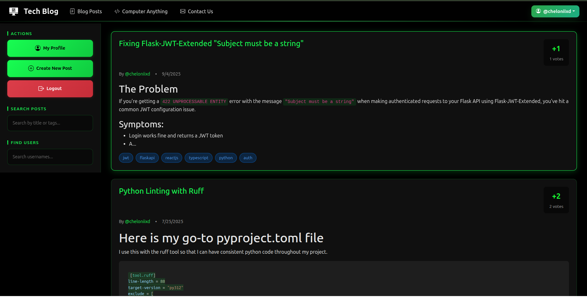

# 📝 Computer Anything Blog

A full-featured tech blog platform built with Flask (backend), React.js (frontend), and PostgreSQL.
Features include user authentication, post creation/editing, voting, comments, and more.

---

## 📸 Screenshots


*Page for viewing and searching all blog posts*


*Page for viewing a single blog post with comments*


*User profile page with post history*

---

## ✨ Features

- User registration, login, and JWT authentication
- Create, edit, and delete blog posts
- Upvote/downvote posts
- Comment on posts (with delete support)
- Search and filter posts by tags
- Tag support (with automatic formatting)
- User profile and post history
- Responsive, modern UI with modals and loading overlays
- Secure API endpoints

---

## 🛠️ Backend Setup

1. **Navigate to the `backend` directory:**

    ```bash
    cd backend
    ```

2. **Install dependencies:**

    ```bash
    pip install -r requirements.txt
    ```

3. **⚙️ Set up the database connection in `config.py`, and configure any environment variables you might need.**

4. **📦 Make initial database migrations:**

    ```bash
    flask db init
    flask db migrate -m "initial migration"
    flask db upgrade
    ```

---

## 🌐 Frontend Setup

1. **Navigate to the `frontend` directory:**

    ```bash
    cd frontend
    ```

2. **Install dependencies:**

    ```bash
    npm install
    ```

3. **🚀 Start the React application:**

    ```bash
    npm start
    ```

---

## 🐳 Docker Compose Setup

1. **Build and start all services:**

    ```bash
    docker compose up --build -d
    ```

2. **Check logs for all services:**

    ```bash
    docker compose logs -f
    ```

3. **Stop all services:**

    ```bash
    docker compose down
    ```

4. **(Optional) Rebuild without cache:**

    ```bash
    docker compose build --no-cache
    ```

- Make sure you have your environment variables set in `backend/.env` and `frontend/.env` before building, use the `.env.example` files as templates.
- The frontend should be built locally (`npm run build`) and the output copied to `backend/frontend/build` if you are not building the frontend inside Docker.
- Run `build_and_copy_frontend.sh` to automate this process.

---

## 📦 Dependencies

- **Backend:**
  - Flask
  - Flask-SQLAlchemy
  - Flask-Migrate
  - Flask-JWT-Extended
  - Flask-Cors
  - psycopg2-binary (psql database adapter)
  - resend (for email sending)
  - python-dotenv
  - pytest (for testing)
  - ruff (for linting)
  - black (for code formatting)

- **Frontend:**
  - React
  - React Router
  - Axios
  - Redux Toolkit
  - Redux Persist
  - React Redux
  - Tailwind CSS
  - react-markdown (for rendering markdown)
  - react-quill (for rich text editing)
  - dotenv (for environment variables)

---

## 🧪 Testing

- **Backend:**
  - Run tests using pytest:

    ```bash
    pytest
    ```

- **Frontend:**
  - Run tests using Jest:

    ```bash
    npm test
    ```

---

## 🔧 Environment Variables

  ```sh
  # Flask environment variables
  SECRET_KEY=your_secret_key
  JWT_SECRET_KEY=your_jwt_secret_key

  # Database configuration
  POSTGRES_USER=postgres_user
  POSTGRES_PASSWORD=postgres_password
  POSTGRES_DB=postgres_db
  DATABASE_URL=postgres://your_username:your_password@db:5432/your_db_name

  # SMTP configuration
  RESEND_API_KEY=your_resend_api_key

  # React environment variables
  REACT_APP_BACKEND_URL=http://localhost:5000
  REACT_APP_RECAPTCHA_SITE_KEY=your_recaptcha_site_key

  # reCAPTCHA configuration
  RECAPTCHA_SECRET_KEY=your_recaptcha_secret_key
  ```

---

## 📜 License

This project is licensed under the MIT License.
