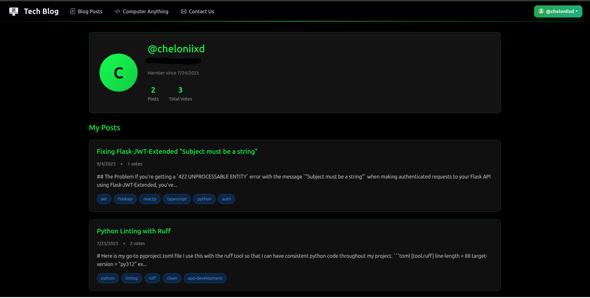

# 📝 Computer Anything Blog

A full-featured tech blog platform built with Flask (backend), React.js (frontend), and PostgreSQL.
Features include user authentication, post creation/editing, voting, comments, and more.

---

## 📸 Screenshots


*Page for viewing and searching all blog posts*


*Page for viewing a single blog post with comments*


*User profile page with post history*

---

## 📂 Project Structure

```bash
cpt_anything_blog/
├── backend/
│   ├── app.py
│   ├── models.py
│   ├── routes.py
│   ├── config.py
│   ├── requirements.txt
│   ├── .env
│   └── migrations/
├── frontend/
│   ├── public/
│   │   ├── index.html
│   │   └── img/
│   ├── src/
│   │   ├── App.js
│   │   ├── components/
│   │   ├── context/
│   │   ├── services/
│   │   └── index.js
│   ├── styles/
│   ├── package.json
│   └── .env
├── README.md
└── docker-compose.yml
```

---

## 🛠️ Backend Setup

1. **Navigate to the `backend` directory:**

    ```bash
    cd backend
    ```

2. **Install dependencies:**

    ```bash
    pip install -r requirements.txt
    ```

3. **⚙️ Set up the database connection in `config.py`, and configure any environment variables you might need.**

4. **📦 Make initial database migrations:**

    ```bash
    flask db init         # Only once, to initialize migrations folder
    flask db migrate -m "initial migration"
    flask db upgrade
    ```

---

## 🌐 Frontend Setup

1. **Navigate to the `frontend` directory:**

    ```bash
    cd frontend
    ```

2. **Install dependencies:**

    ```bash
    npm install
    ```

3. **🚀 Start the React application:**

    ```bash
    npm start
    ```

---

## ✨ Features

- ✅ User registration, login, and JWT authentication
- 📝 Create, edit, and delete blog posts
- 🗳️ Upvote/downvote posts
- 💬 Comment on posts (with delete support)
- 🔍 Search and filter posts by tags
- 🏷️ Tag support (with automatic formatting)
- 👤 User profile and post history
- 🖼️ Responsive, modern UI with modals and loading overlays
- 🛡️ Secure API endpoints

---

## 🔧 Environment Variables

**Frontend (`frontend/.env`):**

```env
REACT_APP_API_URL=http://localhost:5000/api
```

**Backend (`backend/.env`):**

```env
DATABASE_URL=your_database_url
SECRET_KEY=your_secret_key
JWT_SECRET_KEY=your_jwt_secret_key
MAIL_USERNAME=your_email@gmail.com
MAIL_PASSWORD=your_email_password
```

---

## 📜 License

This project is licensed under the MIT License.

---

> 💡 **Tip:**
> For production, set your environment variables in your hosting provider’s dashboard (e.g., Render, Heroku, etc).
